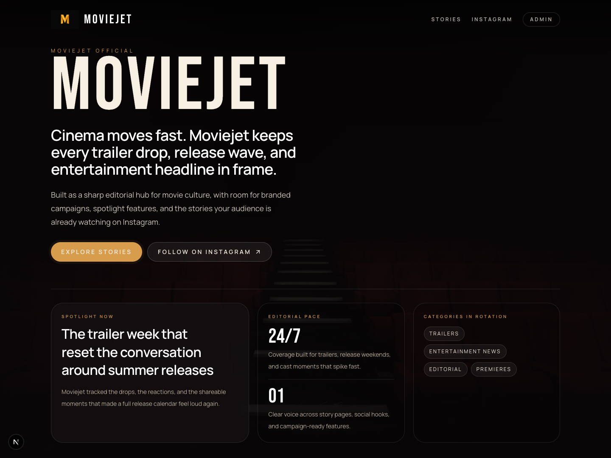
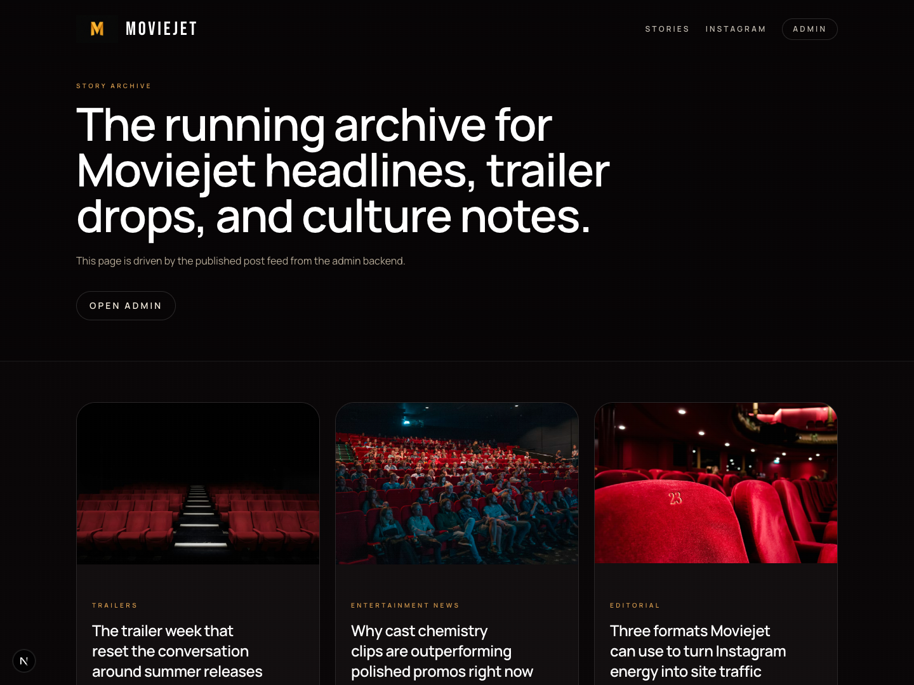
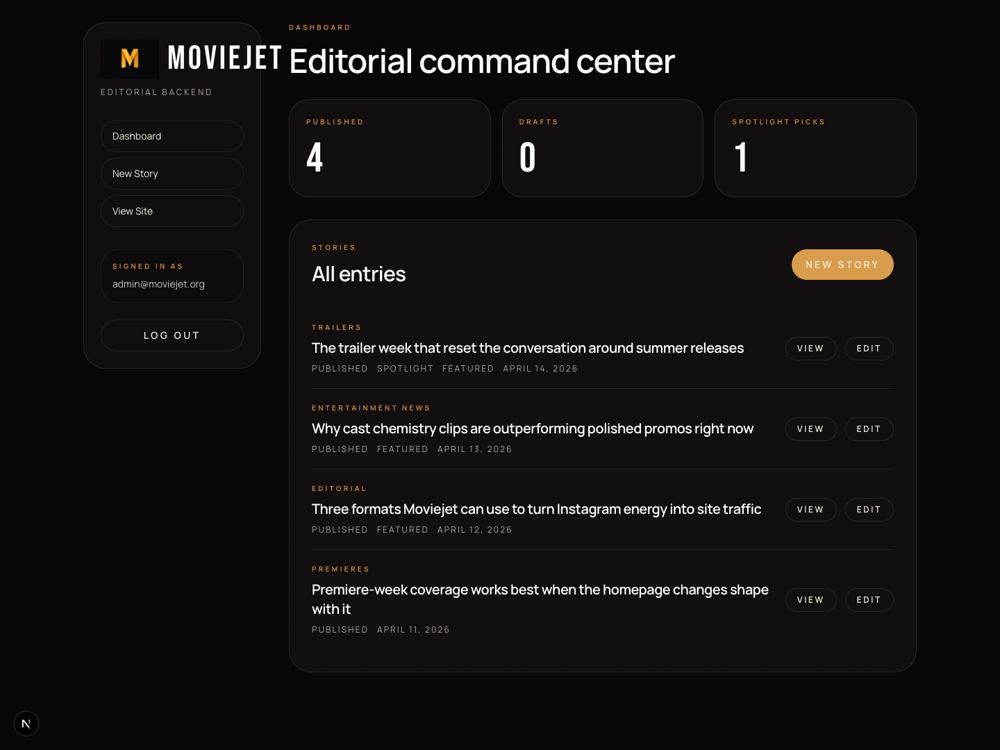

# Moviejet

Moviejet is a Next.js editorial entertainment site with a lightweight backend for publishing stories, spotlighting featured posts, and handing day-to-day content updates to a non-technical editor.

## Screenshots

### Homepage



### Story archive



### Admin dashboard



## Stack

- Next.js App Router
- Tailwind CSS v4
- File-backed JSON content store for local editing
- Cookie-based admin login for content management

## Local setup

1. Copy `.env.example` to `.env`.
2. Set `ADMIN_EMAIL`, `ADMIN_PASSWORD` (or `ADMIN_PASSWORD_HASH`), and `SESSION_SECRET`.
3. Install dependencies:

```bash
npm install
```

4. Seed starter content:

```bash
npm run content:seed
```

5. Start the dev server:

```bash
npm run dev
```

## Admin access

- Login page: `/login`
- Admin dashboard: `/admin`

The editor can:

- create new stories
- update story content
- publish or save drafts
- choose a homepage spotlight story
- mark stories as featured
- add a YouTube trailer link for the trailer block

## Handoff notes

- The domain can be transferred separately from the codebase.
- The hosting account, domain registrar, and admin credentials should all end up under the final owner.
- For production, replace the plain `ADMIN_PASSWORD` with `ADMIN_PASSWORD_HASH` and move from file storage to a managed database if you need multiple editors or durable cloud hosting.
